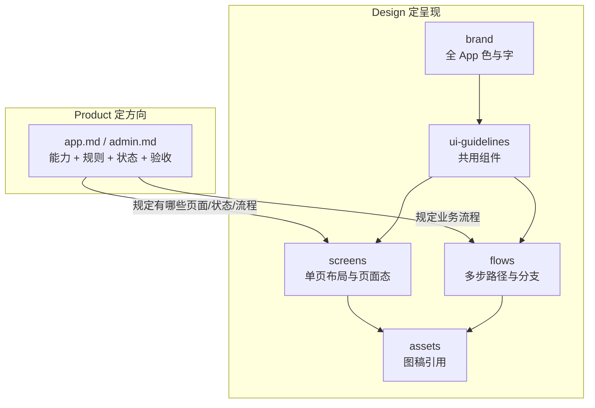

## 八、复述专章：Product 与 Design 五层（是什么 · 关系 · 为何对应）

> 本节专门用于**对人讲清楚** product 和 design 各是什么、五层 design 各管什么、它们怎么挂在一起、为什么不是五份复印。可整段口述，也可按小标题拆开答问。

### 8.1 Product 是什么、不是什么

**是什么**

- `docs/product/` 里的文档，回答：**做不做、为谁做、做到什么算完成**。
- 当前主文档是 `requirements/app.md`（App）和 `requirements/admin.md`（管理后台）。
- 里面写的是：产品定位、用户与场景、页面/路由是否存在、**功能清单**、**业务规则**（例如时长不足要阻断）、**状态含义**（idle / ready / failed）、**异常怎么处理**、关键流程步骤、数据字段含义、MVP 优先级。

**不是什么**

- 不是设计稿，不写色值、圆角、动画时长。
- 不是接口实现，不写具体 API 路径和代码。
- 不是每个版本复制出来的历史档案（那在 `release/notes` 或 `archive/`）。

**一句话口述**

> Product 是**需求和验收标准**：开发做完能不能上线，测试按它判对错。

---

### 8.2 Design 五层分别是什么、不是什么

| 层级 | 是什么（口述用） | 不是什么 |
|------|------------------|----------|
| **brand** | 全 App 的「长相基调」：主色、字色、字体层级、图标风格 | 某一页怎么排版；业务规则 |
| **ui-guidelines** | 到处都会用到的「标准零件」：TabBar、导航栏、播放器、底部 Sheet、确认弹窗等 | 某一页独有布局；「会员能不能用」 |
| **screens** | **某一屏**从上到下怎么摆、这一屏特有的空态/错误态/手势 | 完整业务规则正文；跨多页的点击顺序 |
| **flows** | **跨多步**怎么点：从 A 到 B 到 C，含分支（不足额、失败重试） | 静态线框；数据表结构 |
| **assets** | 给文档引用的图：截图、标注稿、动效参考（链到 Markdown） | PRD 正文；工程里的图片资源代码 |

**一句话口述**

> Design 五层是从**全局视觉 → 通用零件 → 单页 → 多步操作 → 附图**，一层比一层更具体；不是五个重复的需求文档。

---

### 8.3 它们之间的关系（怎么挂在一起）

用一张关系图记牢（口述时可手画）：

**三种关系（背这三条）**

1. **上下依赖（design 内部）**  
   brand 约束全局颜色 → guidelines 里的按钮/卡片用这些色 → screens 用这些组件拼成一页 → flows 描述在这页上点什么、弹出什么 Sheet → assets 给 screens/flows 配图。

2. **左右对照（product → design）**  
   Product 写「录音详情要能分析、有四态、时长不足要阻断」；Design 分别在 screens（详情长什么样）、flows（点立即生成后几步）、guidelines（分析面板、播放器）、brand（按钮/错误色）里**落实呈现**。  
   **不是** product 写一段、design 五处各抄一段。

3. **一对多（一条 product，可能只动一层 design）**  
   改主色 →  often 只动 brand；改详情布局 → screens；改分析步骤顺序 → flows；新加一个全 App 都用的 Sheet → guidelines。  
   一条需求**不必**改满五层。

**和代码的关系**

- Product + Design **都不写代码**；实现分别在 `apps/android/`、`web/apps/admin/`。
- `docs/development/` 承上启下：把 product 的规则和 design 的交互，落成 API、数据模型（开发阶段再写）。

---

### 8.4 为什么是这样的对应关系（为什么这样拆）

**为什么 product 和 design 要分开**

| 原因 | 说明 |
|------|------|
| 问题不同 | Product 答「能不能、该不该」；Design 答「好不好认、好不好点」。 |
| 改的频率不同 | 改按钮颜色不应改 PRD；改「是否扣时长」不应只改 Figma。 |
| 读者不同 | 测试验收功能看 product；UI 走查看 design；各取所需。 |
| 避免 PRD 爆炸 | 把 499 行 PRD 再塞进柱宽 1.45px，谁也维护不了。 |

**为什么 design 要拆五层而不是一个 design.md**

| 原因 | 说明 |
|------|------|
| 复用 | TabBar、播放器在首页、详情、录音页都用；写进 guidelines **只维护一处**。 |
| 粒度 | brand 改一次全 App 生效；screens 只改详情不影响知识库页。 |
| 分工 | 设计师改 flows/screens；品牌改 brand；开发查 guidelines 实现组件。 |
| 可检索 | 实现播放器直接打开 §5，不必在 PRD 里搜索。 |

**为什么是「对应」而不是「复印五份」**

- **对应** = Product 里每一条能力/状态/规则，在 design 里**找得到** UI 或交互落点（可追溯、可验收）。
- **复印五份** = 同一段话贴进 brand、screens、flows… → 一改改五处，必然不一致。

**为什么 assets 单独一层**

- 文字 specs 对间距、动效仍不够直观；图给评审和测试「是不是这版」。
- 图不放 PRD 里，避免仓库臃肿；Markdown 用链接引用即可。

---

### 8.5 复述稿（约 2 分钟，可原样讲）

> 我们项目里，**Product** 在 `docs/product`，主 PRD 是 `app.md`，管的是**做什么和规则**：有哪些页面、功能、状态、异常怎么处理、怎样算验收通过。它不管按钮圆角是多少。
>
> **Design** 在 `docs/design`，拆成五层，管的是**长什么样、怎么点**。
>
> 最上面 **brand** 是全 App 的颜色和字体；  
> **ui-guidelines** 是可复用零件，比如 TabBar、播放器、底部 Sheet；  
> **screens** 是某一页的布局和这个页面特有的空态、错误态；  
> **flows** 是跨好几步的操作，比如详情里点「立即生成」之后查余额、四步进度、失败重试；  
> **assets** 是文档里引用的截图和标注稿。
>
> 关系和依赖是：product 定方向和规则，design 负责呈现；design 内部 brand 托住 guidelines，guidelines 托住 screens，screens 和 flows 一起可以被 assets 配图。product 里写「详情有四个分析状态」，screens 和 guidelines 画这四个状态长什么样，flows 画用户怎么从 idle 走到 ready。
>
> 对应关系**不是**把 PRD 复制五遍，而是**一条需求在 design 里找得到落点**；小改动可能只改一层，比如只改主色就只动 brand。
>
> 这样拆，是为了 PRD 不臃肿、组件不重复写、开发和测试各查各的文档，发版时也不用复制整份 PRD，版本差异记在 release 里就行。

---

### 8.6 快问快答（自测能否复述）

| 问题 | 参考答案（一句） |
|------|------------------|
| Product 管什么？ | 做什么、规则、状态、验收，不管像素。 |
| screens 和 flows 区别？ | screens 是一屏布局；flows 是多步怎么点、分支怎么走。 |
| guidelines 和 screens 区别？ | guidelines 是多处共用的零件；screens 是这一页怎么拼。 |
| 为什么 product 不直接写设计？ | 分工、维护成本、读者不同，避免 PRD 爆炸。 |
| 五层都要改吗？ | 不必，按改动类型选一层或几层。 |
| 「对应」是什么意思？ | PRD 每条能在 design 找到 UI/交互落点，不是复印五份。 |

---
